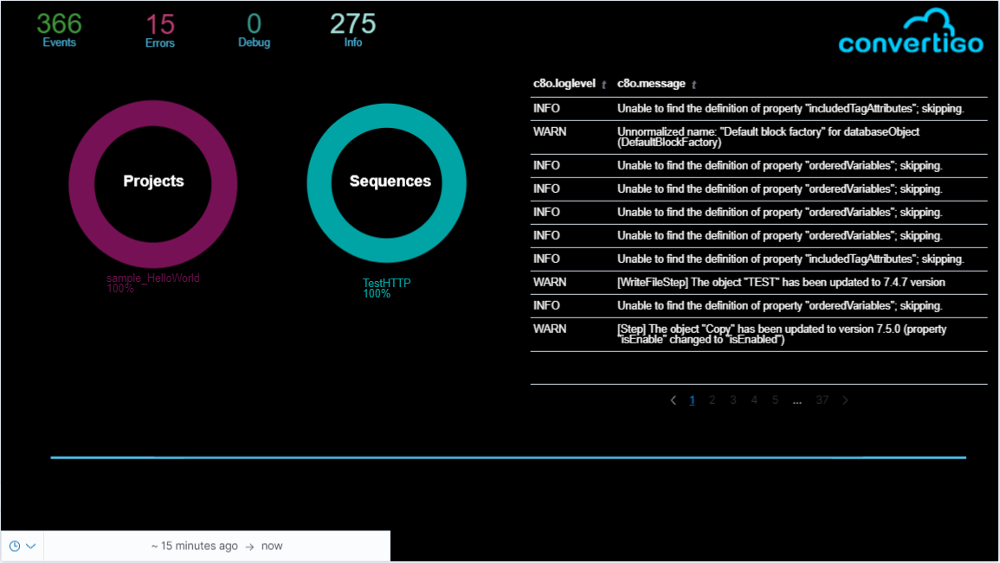

# elk-kibana-logstash
This repository holds sample configurations to integrate Convertigo with Elastic Search / Kibana / Logstash for log analysis and reports.



## How to install
This is using docker-compose so you need a docker environment with docker-compose to use this stack.

Docker runs on Linux or on Windows 10 WSL2 environments. Please refer to both environment documentation to setup your docker-compose.

## Sample configuration files

|Name                |  Usage
| ----               |------------------------------------------
| docker-compose.yml | The docker-compose definition stack for ELK including ELK, Kibana & Logstash
| docker-compose-c8o.yml | The docker compose definition for a complete Convertigo stack including Convertigo, CouchDB, MySQL for billing & filebeat to crunch and send logs to logstash.
| filbeat.yml | The filebeat (Log cruncher process..) configuration file
| logstash.conf | The logstash (Log parser process...) configuration file holding the GROK filters to parse Convertigo logs. 
| ConvertigoCanvas.json |A Convertigo Canvas sample to display various information on Kibana Canvas.

## Starting and stopping the stacks

To start the ELK stack...

```console
$ docker-compose up
```

To start the Convertigo stack...

```console
$ docker-compose -f docker-compose-c8o.yml up
```

NOTE: The Convertigo stack must be able to access the ELK Stack with the ip:port configured in the filebeat.yml file to push log information in logstash.

(You can CTRL-C on your terminal window to stop a stack...)

## Accessing the stacks

You can access Convertigo Console at (http://localhost:28080/convertigo)

You can access Kibana Console at (http://localhost:5601)